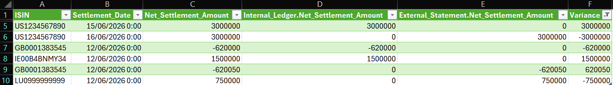
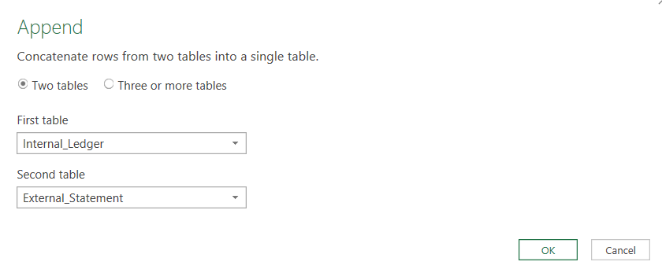
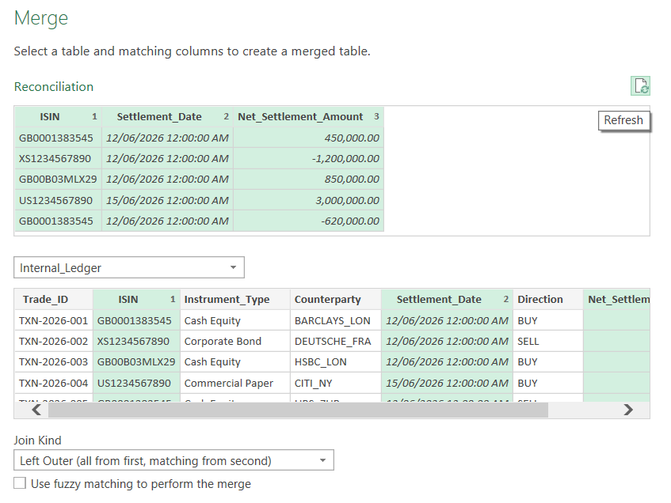
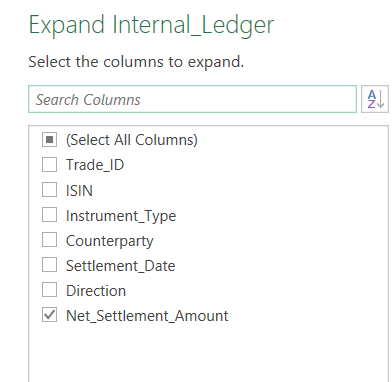
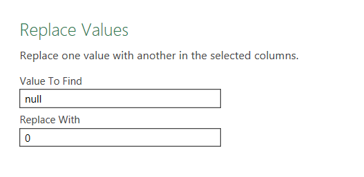
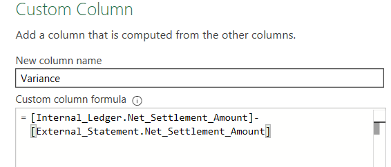

# Automated_Financial_Reconciliation
In financial markets and market operations reconciliations are a critical risk management function. This project delivers an automated reconciliation tool using Power Query. 

## Executive Summary
In banking, ensuring loans are securely matched by collateral is vital to prevent financial exposure. This project delivers an automated risk application that calculates risk-adjusted collateral values in real time.
By automating the data pipeline, the tool eliminates manual lookup issues and protects the desk from human error. It evaluates user inputs for the collateral and automatically applies the total haircut percentage, based on precise foreign exchange (FX) penalty buffers for cross-currency trades, to calculate the maximum eligible loan. Ultimately the calculator ensures strict regulatory compliance, protects firm liquidity and significantly improves data integrity.

## Visual Preview

## Problem Statement
Daily reconciliation of internal trade books against external statements requires a lot of manual processing which is time consuming and leaves a lot of room for human error. This makes it difficult for operations teams to find and fix financial discrepancies before market deadlines, leading to financial exposure and increased risk.

## Objectives
* **Automation** - Replace a manual trade reconciliation process with a fully automated, scalable Power Query ETL Pipeline.
* **Reduce Errors** - Reduce human error by removing manual human intervention from the reconciliation loop.
* **Process Optimisation** - Save time by transforming the workflow into an exception reporting tool that highlights systematic discrepancies with a click of a button. 

## Operational Scenario & Data Sets
The project uses two data inputs, an Internal Ledger and an External Bank Statement. Both datasets are populated with fictional data entries that have been created to represent a realistic market operations desk. The csv files can be found un the main branch of the repository.

### Internal Ledger (Front Office)
Contains details on transactional records booked by the trading desk, key fields include:
* Trade_ID (Unique internal identifier)
* ISIN (Security identifier)
* Counterparty (Client)
* Net_Settlement_Amount (Value of contract)

### External Bank Statement
A post trade statement provided by the third party bank, key fields include:
* Clearing_Ref (External Tracking ID)
* ISIN (Security Identifier)
* Value_Date (Settlement Date)
* Movement (Receive/Deliver)
* Settlement_Amount (Cash value)

## Technical Implementation & ETL Pipeline

The goal of any reconciliation is to identify the differences between two or more inputs.

The steps to do this are:
*1 Create a list of unique references of all inputs
*2 Merge the queries to the unique list
*3 Calculate the variance

### Step 1: Create a list of unique references
Because a trade could exsist in the Internal Ledger but be missing from the External Statement or vice versa, means I couldn't rely on just one files list of ID's.

In the example the Settlement Date, Direction and Settlement Amount column headings don't have the same names in both data sets. So to start the column headings for both tables where set to Settlement_Date, Direction and Net_Settlement_Amount.

Next Append the Queries, to do this from the ribbon, click Home > Append Queries > Append Queries As New.
In the Append Queries dialog box, include both the Internal Ledger and the External Statement queries, click ok.

*Figure 2.0: Dialog box showing the two queries to be appended*

Rename the query to Reconciliation.

Now retain only the reference columns. Select ISIN, Settlement_Date and Net_Settlement_Amount columns and remove other columns. Then select these columns and remove duplicates. This creates a unique list of references from both inputs, the reconciliation differences must be in these records.

### Step 2: Merge the queries to the unique list
Select the Reconciliation query, click Home > Merge Queries. In the Merge window, select the Internal Ledger query as the second table, click the ISIN, Settlement_Date and Net_Settlement_Amount columns. Ensure the join type is Left Outer and click ok.

*Figure 3.0: Dialog box showing the Merge Window*

The message at the bottom of the merge window tells us that - records in the unique list are missing from the Internal Ledger.

Click the arrow at the top of the Internal Ledger column, only click the Net_Settlement_Amount column, this is the column to be reconciled.

*Figure 4.0: Dialog box showing the Net_Settlement_Amount column to be reconciled*

The missing values show as null values in the Net_Settlement_Amount column. Select the column and click Transform from the ribbon and Replace Values, replace null values with 0, so these values can be calculated on.

*Figure 5.0: Replace Null values*

The reconciliation query now looks like this:

*Figure 6.0: First Reconciliation*

Then merge the second query, repeat the same steps as above for the External Statement.

Now we have a Reconciliation query with the data from both the Internal Ledger and External Statement queries.

### Step 3: Calculate the differences
The final step is to calculate the differences. Click Add Columns > Custom Columns. In the Custom Column dialog box, edit the column name to Variance and as the formula subtract the External Statement from the Internal Ledger.

*Figure 7.0: Calculate Variance*

Next change the data type of the Variance column to decimal number. Finally filter the variance column to remove 0 values. Now we have a list of the differences from both tables. Close and load the query into Excel.

