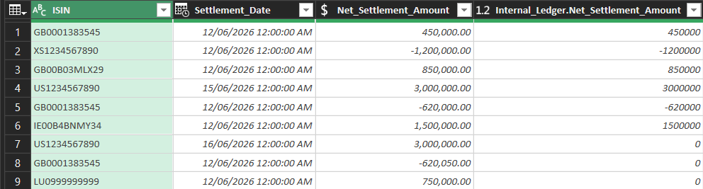
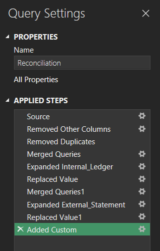

# Automated Financial Reconciliation 

## Executive Summary
In financial markets and market operations, reconciliations are a critical risk management function. This project modernizes a manual spreadsheet workflow by replacing it with an automated ETL Pipeline engineered in Excel Power Query. Reconciling internal trade logs against external custodian statements manually is highly inefficient and significantly increases the risk of settlement and trade failures. To solve this, the tool implements a strict three-step reconciliation framework: it creates a master list of unique ISIN numbers and date references, aligns the internal ledger alongside the external statement, and applies a custom variance column to calculate financial differences instantly. The result is an institutional-grade control tool that removes manual processing risk and allows operations desks to isolate critical breaks in seconds before markets close.

## Visual Preview

*Figure 1.0: Image of the complete reconciliation table*

## Problem Statement
Daily reconciliation of internal trade books against external clearing statements historically required heavy manual data processing, which was highly time-consuming and increased the risk of human error. This operational bottleneck made it difficult for middle-office teams to quickly isolate and action financial discrepancies before strict daily market deadlines, resulting in unnecessary financial exposure and settlement risk.

## Objectives
* **Automation:** Replace a legacy, manual trade reconciliation process with a fully automated, scalable Power Query ETL Pipeline.
* **Reduce Errors:** Mitigate operational risk and eliminate human error by removing manual spreadsheet intervention from the reconciliation loop.
* **Process Optimization:** Accelerate resolution times by transforming the workflow into an automated exception reporting engine that highlights systematic discrepancies at the click of a button. 

## Operational Scenario & Data Sets
The project processes two distinct data inputs: an Internal Ledger and an External Bank Statement. Both datasets are populated with fictional transactional entries engineered to accurately simulate a realistic investment banking market operations desk. The raw CSV source files can be found in the main branch of this repository.

### Internal Ledger (Front Office)
Contains high-fidelity transactional records as booked by the trading desk. Key fields include:
* `Trade_ID` (Unique internal identifier)
* `ISIN` (Security identifier)
* `Counterparty` (Executing client/broker)
* `Net_Settlement_Amount` (Contractual cash value)

### External Bank Statement
A post-trade clearing statement provided by the third-party agent/custodian bank. Key fields include:
* `Clearing_Ref` (External tracking ID)
* `ISIN` (Security identifier)
* `Value_Date` (Contractual settlement date)
* `Movement` (Receive/Deliver direction)
* `Settlement_Amount` (Actual cash clearing value)

---

## Technical Implementation & ETL Pipeline

The core goal of any financial reconciliation is to efficiently isolate the structural differences between two or more data inputs. 

This pipeline achieves this by executing a structured three-step framework:
1. Create a list of unique references across all inputs.
2. Merge the source queries against that unique master list.
3. Calculate the absolute variance to expose financial breaks.

### Step 1: Create a List of Unique References
Because a trade could exist in the Internal Ledger but be missing from the External Statement (or vice versa), the pipeline cannot rely on the ID list of just one file. 

To resolve this, the column headings for both source tables were first standardized to match identically (`Settlement_Date`, `Direction`, and `Net_Settlement_Amount`). 

Next, the queries were combined using an Append transformation. From the Power Query ribbon, select **Home > Append Queries > Append Queries As New**. In the dialog box, include both the `Internal_Ledger` and `External_Statement` queries, then click OK.

*Figure 2.0: Dialog box showing the two queries to be appended*

Rename the newly generated query to `Reconciliation`.

To isolate the core keys, retain only the reference columns: select the `ISIN`, `Settlement_Date`, and `Net_Settlement_Amount` columns, right-click, and select **Remove Other Columns**. Finally, select these remaining columns and click **Remove Duplicates**. This establishes a master list of unique transactional references across both inputs, ensuring any data anomaly will be caught.

### Step 2: Merge the Queries to the Unique List
Select the `Reconciliation` query and click **Home > Merge Queries**. In the Merge configuration window, select the `Internal_Ledger` query as the second table. Select the `ISIN`, `Settlement_Date`, and `Net_Settlement_Amount` columns in both tables to create a composite joining key. Ensure the Join Kind is set to **Left Outer** and click OK.

*Figure 3.0: Dialog box showing the Merge Window*

> **Note:** The matching status notification at the bottom of the merge window immediately indicates that 3 records in our unique reference list are missing from the Internal Ledger.

Click the expand icon at the header of the new `Internal_Ledger` column, and select *only* the `Net_Settlement_Amount` column to bring it into the reconciliation frame.

*Figure 4.0: Dialog box selecting the column to be reconciled*

Unmatched entries will pull through as `null` values. To ensure mathematical operations can be performed without errors, select the column, navigate to **Transform > Replace Values**, and replace `null` with `0`.

*Figure 5.0: Replacing null values with zero*

The intermediate reconciliation query layout now displays the standardized internal ledger data side-by-side with the master reference keys:

*Figure 6.0: Query view after processing the first merge*

To complete the data alignment, repeat these exact merge and null-replacement steps for the `External_Statement` query.

### Step 3: Calculate the Differences
With both transactional amounts aligned side-by-side against the unique keys, the final step is to isolate financial breaks. Navigate to **Add Column > Custom Column**. In the dialog box, name the new column `Variance` and program the formula to subtract the external balance from the internal ledger balance.

*Figure 7.0: Creating the mathematical variance column*

The complete, immutable data lineage history generated by this automation pipeline can be audited at any time via the Applied Steps pane:

*Figure 8.0: The complete list of Applied Steps in Power Query*

